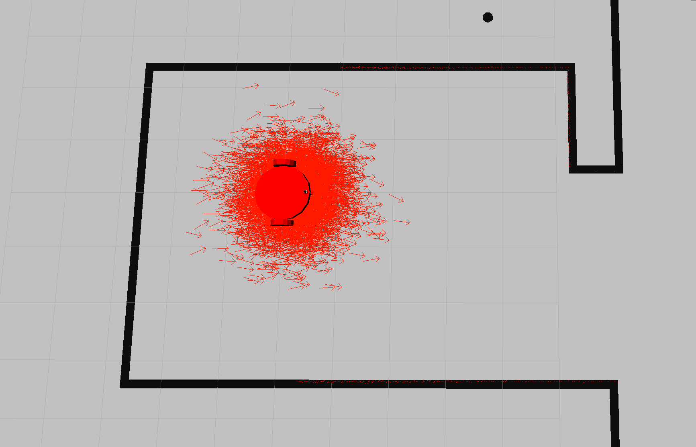
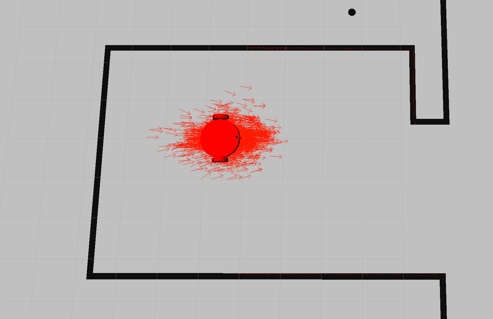
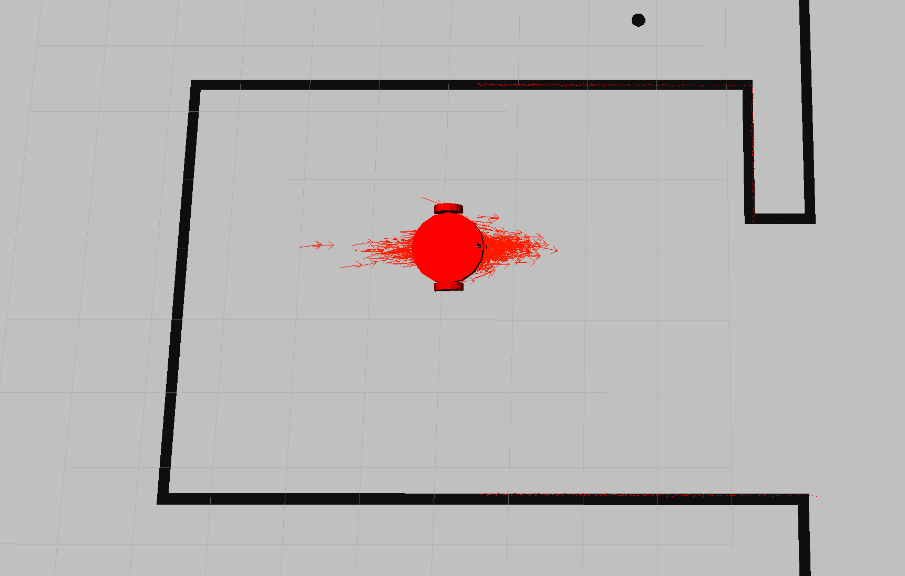
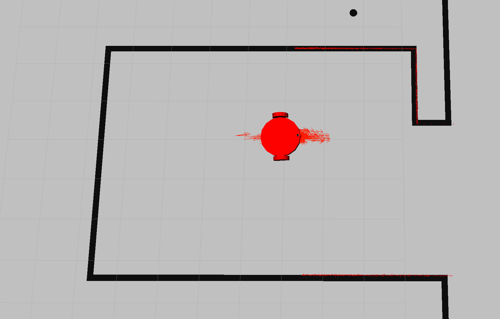
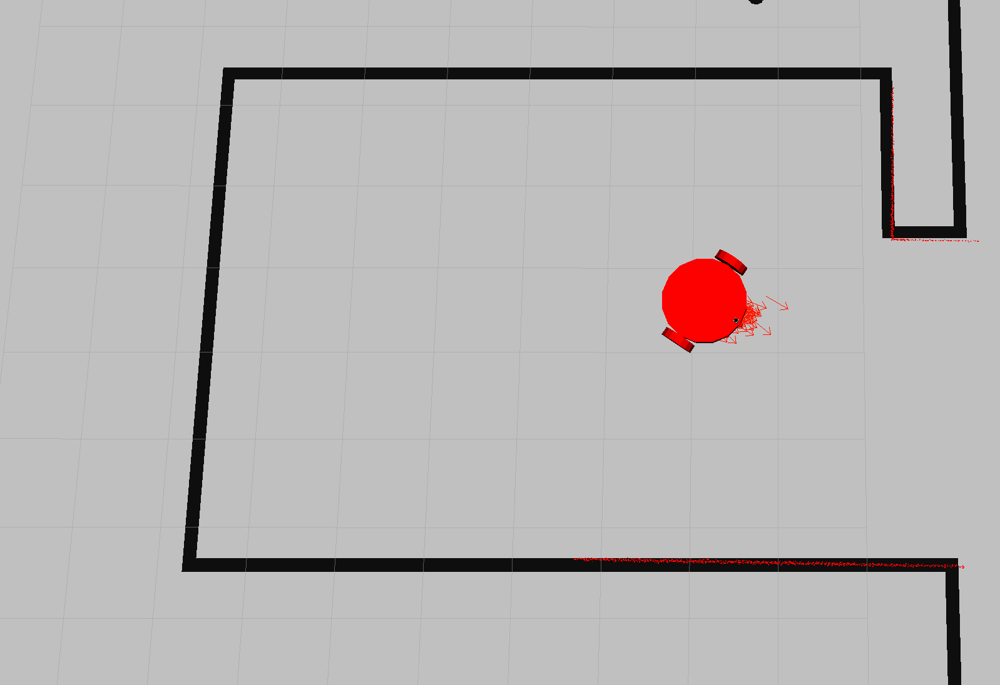

# RoboticsND_Where_Am_I
Build and implement the Adaptive Monte Carlo Localization package on my robot (based on RoboticsND_Build_My_World)

## Localization of my_robot

## Instructions

1. Create and initialize a catkin workspace `catkin_ws`
> $ mkdir -p /***preferred directory***/catkin_ws/src  
> $ cd /***preferred directory***/catkin_ws/src  
> $ catkin_init_workspace  

2. Clone this repo into the `src` directory
> $ cd /***preferred directory***/catkin_ws/src  
> $ git clone https://github.com/RoboticsND_Where_Am_I .

3. Due to the large size of the map.pgm file, they were zipped and will need to be unzipped
> $ cd /***preferred directory***/catkin_ws/src/my_robot/maps  
> $ unzip map.zip && rm map.zip  
> $ cd /***preferred directory***/catkin_ws/src/pgm_map_creator/maps  
> $ unzip map.zip && rm map.zip  

3. Go back to the `catkin_ws` directory and and launch the world
> $ cd /catkin_ws  
> $ catkin_make  
> $ source devel/setup.bash  
> $ roslaunch main main.launch  

The robot is now controllable via the terminal according to the instructions posted. In the RVIZ window, you will see the particle clouds adjusting with time for more accurate localization.

The parameters for the AMCL are located in `catkin_ws/src/my_robot/launch/amcl.launch`.
